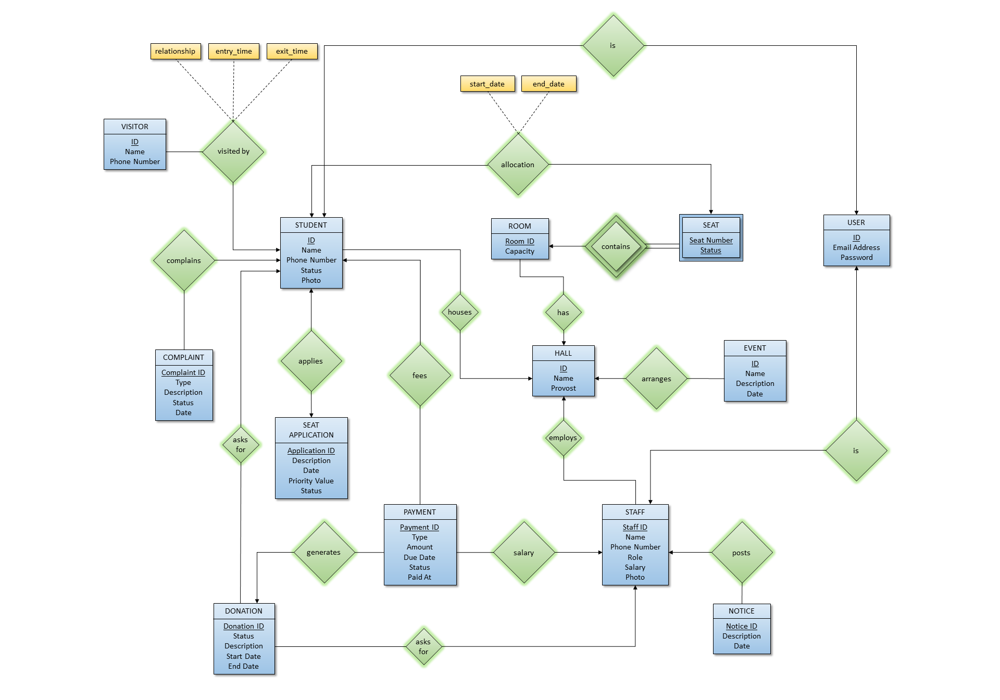

# Hallmate

Hallmate is a university hall management system built for a Database Management System project. It provides role-based workflows for students, staff, provost, and super user to manage accommodation, payments, events, notices, complaints, tasks, and forum interactions.

## Team

- Group project submission (one submission per group)
- ZIP naming format for submission: `StudentID1_StudentID2.zip`

## Key Features

- Role-based access for Student, Staff, Provost, and Super User
- Seat application and allocation workflows
- Fees, salary, donation, and payment management
- Complaint and visitor management
- Event and notice publishing
- Task assignment and tracking
- Forum posts, comments, likes, and notifications

## Tech Stack

- Backend: Flask, psycopg (PostgreSQL driver), Flask-CORS
- Frontend: React, TypeScript, Vite
- Database: PostgreSQL

## ERD Diagram

The first diagram below shows the initial database design. The second diagram shows the final database state after all tables, relationships, and features were built.

### Initial Design



### Final Design

.png)

## Project Structure

```text
Hallmate/
|-- backend/
|-- frontend/
|-- Schema/
|-- ERD/
|-- dump.sql
|-- README.md
```

## Prerequisites

Install these tools before running the project:

- Python 3.10+ (or compatible Python 3.x)
- Node.js 18+ and npm
- PostgreSQL 14+ (or compatible)

## Database Setup

Create a PostgreSQL database, then use one of the following setup paths:

### Option 1: Restore from backup dump

This is the easiest one-line setup if you already have the database dump file:

```bash
psql -h <db_host> -U <db_user> -d <db_name> -f backup/backup.sql
```

You can also use the backup file as the source for a clean restore when setting up the project locally.

### Option 2: Run the SQL scripts manually

1. Create the tables using `Schema/schema1.sql`.
2. Run the PL part of the program using `Schema/plsql.sql`.

Note: The older `Schemas.sql` and `mock_data_testing.sql` files are no longer the recommended setup path.

## Backend Setup and Run

From the `backend/` directory:

```bash
python -m venv .venv
```

Activate virtual environment:

- Windows PowerShell:

```powershell
.venv\Scripts\Activate.ps1
```

- Linux/macOS:

```bash
source .venv/bin/activate
```

Install dependencies and run:

```bash
pip install -r ../requirements.txt
python app.py
```

Backend default URL: `http://localhost:5000`

## Frontend Setup and Run

From the `frontend/` directory:

```bash
npm install
npm run dev
```

Frontend dev URL is shown by Vite (commonly `http://localhost:5173`).

Optional production build:

```bash
npm run build
npm run preview
```

## Configuration Notes

- Update the email sender credentials in `backend/app/email_service.py` by setting `SENDER_EMAIL` and `SENDER_PASSWORD`.
- Update the database connection settings in `backend/app/db.py` by setting your DB host, database name, user, password, and SSL mode.
- For cleaner deployment/submission practice, use environment variables for email and DB credentials instead of hardcoding secrets.

## Suggested Test Run Flow

1. Start PostgreSQL and ensure schema/data is loaded.
2. Run backend server.
3. Run frontend server.
4. Open frontend URL and verify login and role dashboards.

## Submission Checklist

- Include all source code (`backend/`, `frontend/`)
- Include database scripts (`Schema/` and backup SQL)
- Include this README with setup steps
- Remove unnecessary generated folders before zipping (`node_modules`, `.venv`, `__pycache__`, build artifacts)
- Create one ZIP file named exactly: `StudentID1_StudentID2.zip`

## License

This project was created for academic coursework.